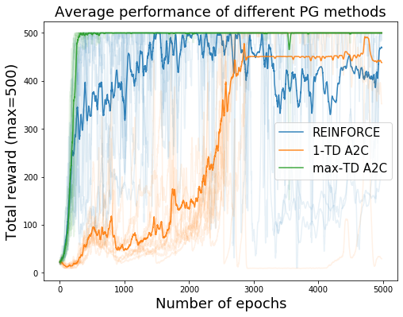
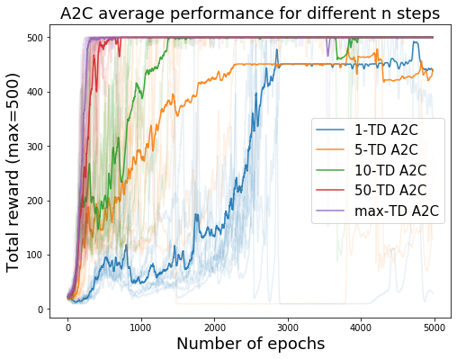

# Policy-based-RL
Repo containing implementation of some policy-based RL agents, starting from scratch. All of them are tested on cartpole environment.

## Actor-Critic setup
At the moment my focus is on Advantage Actor Critic (A2C), that is implemented with two different options to estimate the advantage:
1. Temporal Difference estimate: `A(s,a) = r(s,a) + gamma * V(s') - V(s)`
2. Monte Carlo estimate: `A(s_t,a_t) = \sum_{t'=t}^T gamma^{t'-t} * r(s_t',a_t') - V(s_t)`

Also I introduced two tricks discussed in the Soft Actor-Critic papers, that are:
1. Use 2 networks for the critic and take the minimum between the two estimates to compute the advantages; this is a kind of conservative critic that improves stability.
2. Use a detached target for the critic, that is used to train the critic by estimating what its target should be and is updated through an exponential moving average (i.e. at each update the target retains (1-tau) percentage of the old weights and acquires tau of those of the critic after the update, so it forgets its own weights with an exponential suppression in the number of updates; $\tau$ is called target smoothing coefficient, but can be thought as the forget rate of the target old weights).

I also wrote the code to make a random search in the learning rate, forget rate and actor and critic's architectures (assumed identical between them except from the last layer) and then evaluated the best configuration with the following settings:
* TD or MC
* twin critics or not
* exponential moving average for targets (only in TD case) or not

for a total of 6 combinations. Each has been evaluated for 10 runs of 5000 steps (more than in the random search because I've noticed that the average performance was still increasing).

**TODO:**
1. **Introduce bootstrapping of the terminal states value:** the OpenAI gym environment of Cartpole assigns a reward of +1 to each step and returns a boolean variable `done` that is `True` if the episode is terminated in that step; in that case the value estimated for the last state is just the reward achieved and this is usually expressed as `V(s) = r(s,a) + (1-done) * gamma * V(s')`, where True=1, False=0.
The problem is that the environment returns done=True even if the episode is terminated by truncation because the maximum number of steps (500) is reached and so if we treat the two cases in the same way the agent will not learn that achieving 500 is good, but will try to change strategy in order to achieve more. Bootstrapping in this case would basically mean that we set done=False if truncation happens. This is straightforward in the case of TD learning, whereas in the case of MC learning we can't just do that because we rely on the trajectory (that has been truncated) to estimate the values. So in that case we actually want to use the TD estimate for bootstrapping and the value formula could be something like: 
`V(s_t) = \sum_{t'=t}^T * gamma^{t'-t} * r(s_t',a_t') + gamma^{T+1-t}*(1-done_T)V(s_{T+1})`, where `done_T = 0` only if the episode is ended by truncation. In this way we account for the discounted rewards that we would do from step T+1 on (V already takes into account disconted rewards, but we have to discount it also because it's a future value and not a present one).

## Experimental Results

I used the Evaluation\_notebook to produce the following results for my Master's Thesis (follow up repository at https://github.com/nicoladainese96/SC2-RL/):

Comparison of the REINFORCE, the 1-step Temporal Difference (1-TD) A2C andthe max-steps Temporal Difference (max-TD) A2C algorithms. All solid curves are the average of10 runs, with the number of episodes on the x axis and the moving average over 20 episodes of theepisode reward on the y axis; 500 is the maximum reward obtainable, because after that number ofsteps the episode is truncated automatically. We can see that max-TD A2C is superior to the other2 methods and REINFORCE, while achieving fast initial improvement, it’s the most unstable.

Study of the influence of the n-steps parameter on speed and probability of convergence of then-TD A2C. All solid curves are the average of 10 runs, x and y axis represent the same variablesof (a). In this plot there is a clear trend according to which the greater the n-steps parameter, thefaster is the convergence. Also notice how the two agents with lower n-steps parameter (1 and 5)failed to converge in one run each, lowering the average asymptotic performance to approximately450 (instead of 500 if all 10 runs would have converged).
